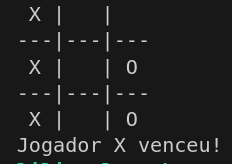

# Labs | Formação C e C++ | [DIO](https://github.com/digitalinnovationone)

[**Módulo I**](https://github.com/LilianMS/repo-curso-c-cplusplus/blob/main/README.md#m%C3%B3dulo-i---paradigmas-da-programa%C3%A7%C3%A3o) - _MicroShell com AOP_

[**Módulo II**](https://github.com/LilianMS/repo-curso-c-cplusplus/blob/main/README.md#m%C3%B3dulo-ii) - _Jogo da Velha em Linguagem C_

[**Módulo III**](https://github.com/LilianMS/repo-curso-c-cplusplus/blob/main/README.md#m%C3%B3dulo-iii) - _Calculadora Simples em Linguagem C_

<!-- [Módulo IV]() -->

---

### Módulo I - Paradigmas da Programação
#### Programação Orientada à Aspectos - AOP

```
Desenvolvendo um Projeto com o Paradigma de Programação Orientado à Aspectos (AOP)
```
- [MicroShell com AOP](https://github.com/LilianMS/repo-curso-c-cplusplus/blob/main/microshell.c)

### Descrição

Atualmente, estou estudando e realizado projetos em ```Linguagem C``` e como não estou estudando C++ ainda e não domino a **programação orientada a objetos**, decidi realizar o exercício com uma aplicação conforme meus interesses atuais. Este documento é parte de um estudo muito simples sobre o funcionamento do ```bash```, pois meu próximo projeto na [42sp](https://github.com/42sp) é o ```MiniShell```, trabalho em equipe que realizarei com a [Letícia](https://github.com/lesampietro). Além disso, estou aprimorando os conhecimentos sobre documentação, controle de versão, Git e GitHub.

Este código aplica a **programação orientada a aspectos (AOP)** de forma simples, separando preocupações transversais como logging e erros.

- Objetivos

    1. Log de execução: Registrar comandos sendo executados.
    2. Centralização do tratamento de erros: Isolar o tratamento de erros em uma função separada.

- Realizado

    1. Função log_execucao:
        Adiciona um log simples cada vez que um comando é executado. Isso permite rastrear a execução de comandos sem modificar a função execve diretamente.

    2. Função log_erro:
        Centraliza o tratamento de erros. Todos os erros são registrados por essa função, facilitando a modificação futura (por exemplo, se você quiser escrever logs em um arquivo ou adicionar níveis de log).

    3. Módulo de logs:
        Separação de logs do restante da lógica. Agora é fácil adicionar novos logs ou modificar o comportamento sem alterar o código principal

- Melhorias futuras

    1. **Validação de comandos:** Você pode criar uma função para validar comandos antes da execução e aplicar de maneira semelhante.

    2. **Múltiplos níveis de log:** Dependendo da criticidade, você pode adicionar diferentes níveis de logs (informativo, erro, etc.).

    3. **Modularização:** Adicionar o código de log e tratamento de erros em arquivos separados para modularizar ainda mais a solução.

### Como testar:

1. **Compilar o código** | Use o compilador gcc para compilar o programa. Execute o seguinte comando no terminal:

```
gcc -o microshell microshell.c
```

Se houver algum erro de compilação, o terminal exibirá mensagens que você pode usar para depurar o código.

2. **Executar o programa** | Agora, execute o programa com alguns comandos para testar se o funcionamento está correto.

Exemplo de execução:

```
./minishell_micro /bin/ls ;
```

>Esse comando deve listar o diretório atual e exibir um log da execução do comando /bin/ls.

3. **Testar com múltiplos comandos** | Tente executar comandos diferentes, como:

```
./minishell_micro cd /tmp ;
./minishell_micro /bin/ls | /usr/bin/wc ;
```

>O primeiro comando altera o diretório atual para /tmp e deve registrar o log da execução do cd.
>O segundo comando usa um pipe (|) para conectar a saída de ls à entrada de wc, contando o número de >linhas, palavras e caracteres.

**Teste de casos específicos:**

- Mudança de diretório inválida:

```
./minishell_micro cd nonexistent_dir ;
```

>Deve resultar em uma mensagem de erro dizendo que não pode mudar o diretório.

- Comando inválido:

```
./minishell_micro nonexistent_command ;
```

>Isso deve retornar um erro de que o comando não pode ser executado, com a mensagem de erro adequada.

- Verificando os Logs

Os logs devem aparecer no terminal, registrando a execução de comandos e qualquer erro. Aqui está um exemplo de como os logs devem parecer:

```
[LOG] Executando comando: /bin/ls
```


----


## Módulo II

### _Aplicações da Linguagem C/C++ no Mundo Real_

[Jogo da Velha em Linguagem C](jogo-da-velha.c) - O resultado deste projeto ficou bem divertido! 🎉 
Um projeto interativo que aguarda respostas dos jogadores e fornece feedback ao usuário pelo terminal.
Podemos visualizar o jogo enquanto é jogado mesmo via terminal do bash.

[](jogo-da-velha.c)


---


## Módulo III

### _Lógica de programação Utilizando Linguagem C_

[Calculadora Simples em Linguagem C](calculadora-simples.c) - Este código mantém um loop até que o usuário escolha sair do programa ou entre com dados válidos para uma expressão matemática simples.
O programa trata erros de input, fornecendo feedback ao usuário.  

[Arquivo executável](calculadora)

---

## Módulo IV

### _Linguagem C | Sistemas Embarcados | Arduino_

[Projeto com Arduino](projeto-arduino.md) 


